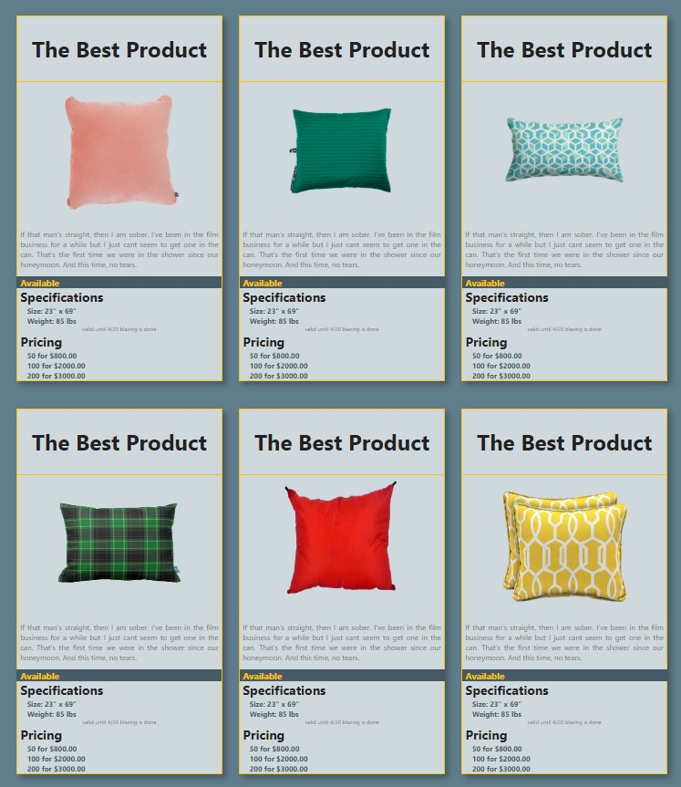
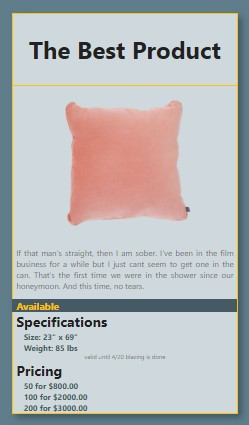

# NSS E12 Exercise - Product Cards

## Description:
The first exercise at NSS. The goal of the exercise was to create a grid of product cards with CSS, HTML, and flexbox.  Here I have created a grid of "The Best Product". 

## Screenshots:
##### Main Grid View:

##### Single Card View:

## How To Run:
>1. Clone down this repo.
>1. Install [http-server](https://www.npmjs.com/package/http-server).
>1. Navigate to folder in command line and type `http-server -p 8080`.
>1. Go to `http://localhost:8080` in your browser.